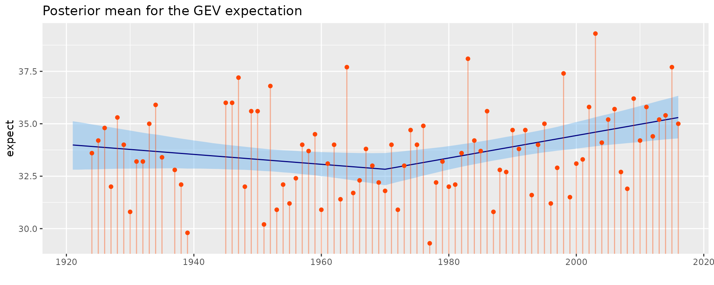
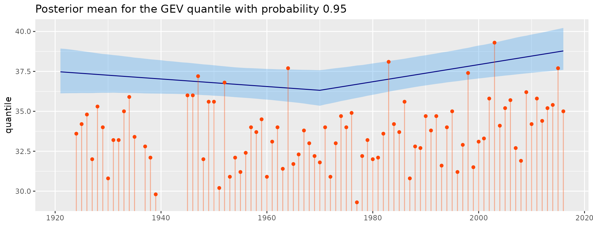
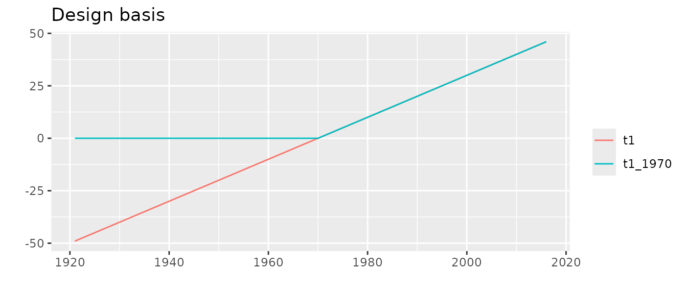
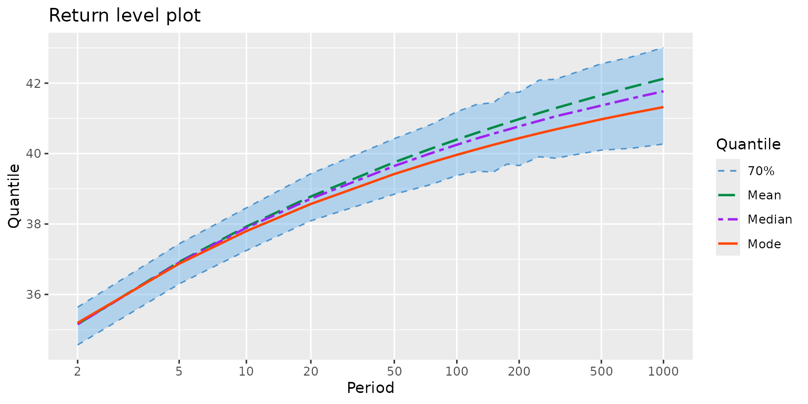
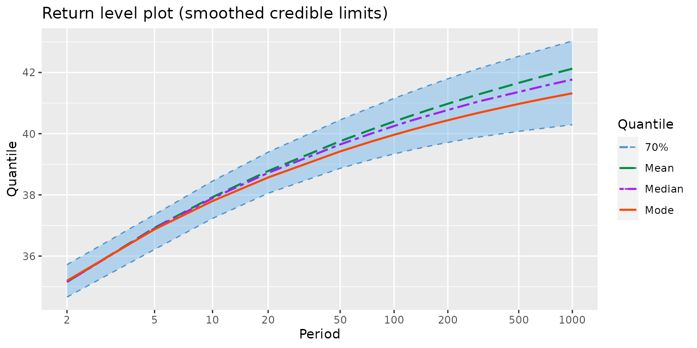
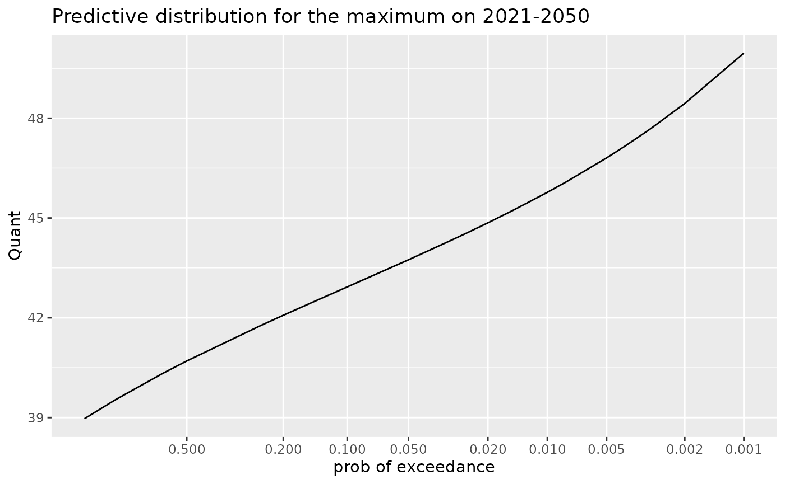
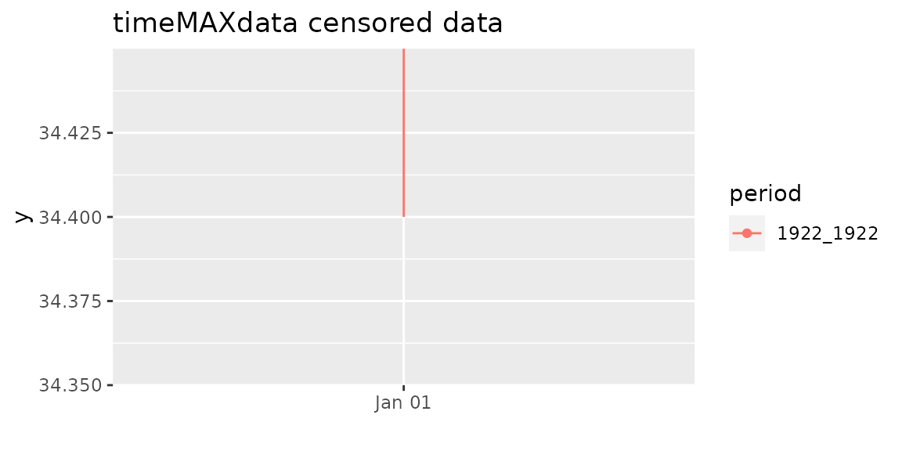
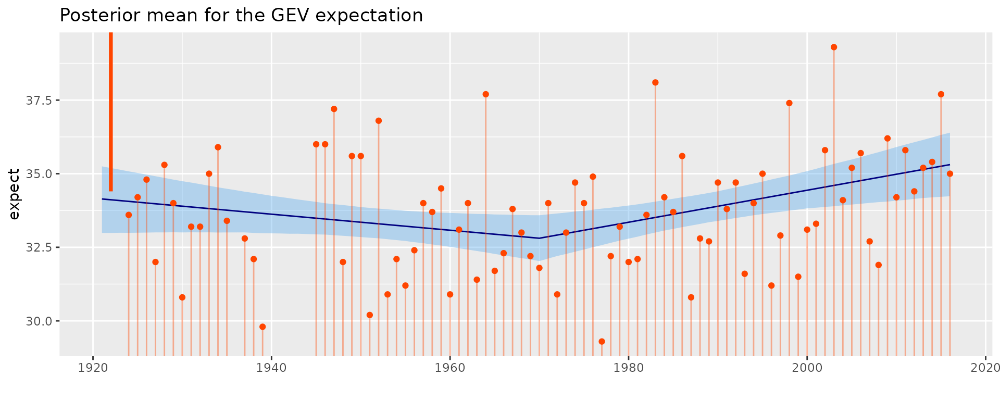
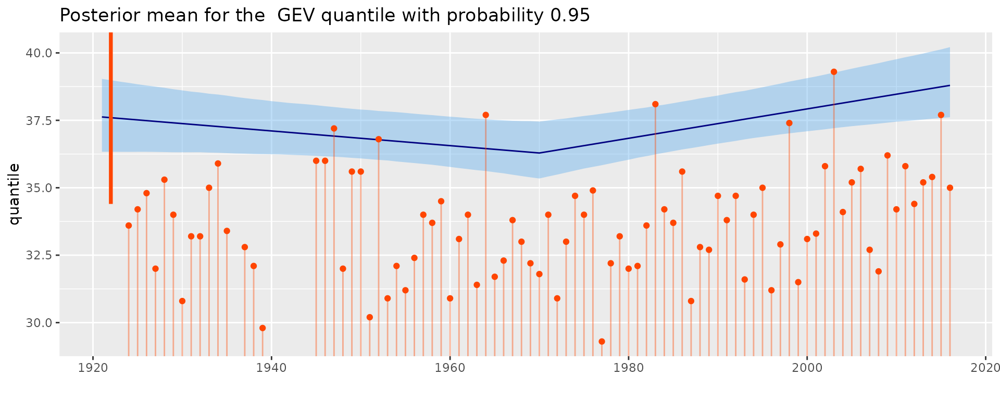
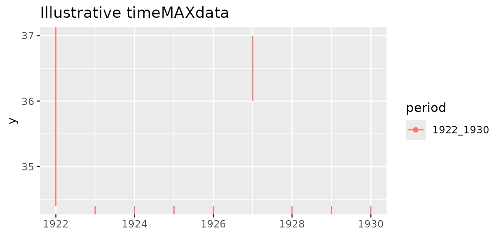

# Overview of the beverstan package

## Note

This report was generated with
[`knitr::spin`](https://rdrr.io/pkg/knitr/man/spin.html). Do not edit
Rmarkdown file by hand!

``` r

library(beverstan)
```

## Bayes TVGEV for the annual maxima of temperature in Dijon

### `TVGEVBayes` objects

The function `TVGEVBayes` is very similar to
[`NSGEV::TVGEV`](https://rdrr.io/pkg/NSGEV/man/TVGEV.html) function. It
uses the same arguments: `data`, `Date`, `response` to define the data
frame to use and the name of the variables date and response in it. The
date variable must be either a column with class `"Date"` or a column
that can be coerced with `as.Date`, typically a character giving dates
in POSIX format. The response contains the annual maxima of daily
maximal values (TX) as recorded in Dijon-Longvic (France). The data
where provided by the [European Climate Assesment &
Dataset](https://www.ecad.eu/).

The `design` argument contains R language: a call to a function
returning a design matrix. Then the three formulas `loc`, `scale` and
`shape` specify the dependence of the GEV parameters on the date. Here
we will use a `design` for a “regression kink”: the response is a broken
line with a change of slope at a threshold point here chosen as 1970.

``` r

df <- within(TXMax_Dijon, Date <- as.Date(sprintf("%4d-01-01", Year)))
fit <- TVGEVBayes(data = df,
                  date = "Date", response = "TXMax",
                  design = breaksX(date = Date, breaks = "1970-01-01", degree = 1),
                  loc = ~ t1 + t1_1970, scale = ~ 1, shape = ~ 1,
                  seed = 1234)
```

    ## Warning: There were 1 divergent transitions after warmup. See
    ## https://mc-stan.org/misc/warnings.html#divergent-transitions-after-warmup
    ## to find out why this is a problem and how to eliminate them.

    ## Warning: Examine the pairs() plot to diagnose sampling problems

The output of the previous code chunk was not shown. The warning can
require further investigation, see later.

``` r

class(fit)
```

    ## [1] "TVGEVBayes"

``` r

methods(class = "TVGEVBayes")
```

    ## [1] autoplot coef     fitted   predict  print    profLik  RL       summary 
    ## [9] vcov    
    ## see '?methods' for accessing help and source code

So we can use `autoplot`.

``` r

autoplot(fit) + ggtitle("Posterior mean for the GEV expectation") + theme_gray() 
```



The posterior mean of the GEV expectation is shown along with a $`95\%`$
credible interval on it. Of course, the credible interval should not be
confouded with a prediction interval, which would be much larger.

Instead of the GEV expectation, we can similarly plot a quantile.

``` r

autoplot(fit, which = "quantile", prob = 0.95) + theme_gray() +
     ggtitle("Posterior mean for the GEV quantile with probability 0.95")
```



Now try the `summary` method

``` r

summary(fit)
```

    ## o Call
    ## TVGEVBayes(data = df, date = "Date", response = "TXMax", design = breaksX(date = Date, 
    ##     breaks = "1970-01-01", degree = 1), loc = ~t1 + t1_1970, 
    ##     scale = ~1, shape = ~1, seed = 1234)
    ## 
    ## o Parameters
    ##                MAP post. mean post. sd post. L post. U
    ## mu_0       32.0391    32.0418   0.3909 31.2701 32.7965
    ## mu_t1      -0.0279    -0.0236   0.0164 -0.0546  0.0086
    ## mu_t1_1970  0.0829     0.0772   0.0288  0.0196  0.1341
    ## sigma_0     1.7696     1.8273   0.1561  1.5526  2.1666
    ## xi_0       -0.1930    -0.1706   0.0736 -0.3046 -0.0170

To remind of the design, we can apply the call on the data frame

``` r

des <- with(df, breaksX(date = Date,  breaks = "1970-01-01", degree = 1))
des
```

    ## Block time series
    ## 
    ## o First block: 1921-01-01
    ## o Last block:  2016-01-01
    ## 
    ##       date          t1     t1_1970 
    ## 1921-01-01 -48.9993155   0.0000000 
    ## 1922-01-01 -48.0000000   0.0000000 
    ## 1923-01-01 -47.0006845   0.0000000 
    ##   ... <more rows>
    ## 2014-01-01  44.0000000  44.0000000 
    ## 2015-01-01  44.9993155  44.9993155 
    ## 2016-01-01  45.9986311  45.9986311

``` r

autoplot(des) + ggtitle("Design basis") + theme_gray()
```



The column `"t1"` defines a linear trend with a slope of
$`1~\text{year}^{-1}`$. The colmun `"t1_1970"` defines a broken line
with a change of slope located at year $`1970`$: the slopes are
$`1~\text{year}^{-1}`$ before $`1970`$, then $`1~\text{year}^{-1}`$. The
parameter names are automatically build by pasting the GEV parameter
name `"mu"`, `"sigma"` or `"xi"` with the name of the variable entering
the formula. Note however that the constant is not taken as
`"(Intercept)"` as in `lm` and many other models, but `"0"`. In the
present case, the eventual slope (after year 1970) is the sum of `mu_t1`
and `mu_t1_1970` because the two basis functions are non-zero then. So
for instance the posterior mean for the eventual slope is 0.0536
$`\text{C}/\text{year}^{-1}`$ or 0.536 $`\text{C}/\text{decade}^{-1}`$.

We can see the (Bayesian) estimates of the parameters, along with
$`95\%`$ credible intervals. Insasmuch the credible interval on
`mu_t1_1970` does not contain $`0`$, we can say that the two slopes
before and after $`1970`$ are significantly different.

We can extract the coefficients with the `coef` method. Since we may
want either the MAP or the posterior mean, the method has an ususual
argument `type` which allows to make a choice.

``` r

coef(fit)
```

    ##        mu_0       mu_t1  mu_t1_1970     sigma_0        xi_0 
    ## 32.03912611 -0.02790677  0.08289061  1.76955738 -0.19296432

``` r

coef(fit, type = "postMean")
```

    ##        mu_0       mu_t1  mu_t1_1970     sigma_0        xi_0 
    ## 32.04182925 -0.02361283  0.07721219  1.82728067 -0.17062777

As its name may suggest, the `RL` method Return Level plot.

``` r

myRL <- RL(fit)
autoplot(myRL) + theme_gray() + ggtitle("Return level plot")
```



The credible limits are empirical quantiles of the MCMC iterates which
explains their wiggling aspect. They can be smoothed, although this is
only for aesthetical reasons.

``` r

myRL <- RL(fit, smooth = TRUE)
autoplot(myRL) + theme_gray() + ggtitle("Return level plot (smoothed credible limits)")
```



We can use the `predict` method

``` r

myPred <- predict(fit)
tail(myPred)
```

    ##    newTimeRange  Prob    Quant
    ## 15    2016_2017 0.008 40.81713
    ## 16    2016_2017 0.005 41.29651
    ## 17    2016_2017 0.004 41.52736
    ## 18    2016_2017 0.003 41.83012
    ## 19    2016_2017 0.002 42.27019
    ## 20    2016_2017 0.001 43.07133

The column `newTimeRange` indicates the time range (or period) on which
the prediction is computed. Note that `Prob` is the probability of
exceedance, so in the classical cas where the extremes are the large
value, the interest is mainly on the last rows. We see that the quantile
with an exceedance probability of $`0.001`$ is 43.07 Celsius.

We can use the `newTimeRange` argument of the method `predict` for the
class `"TVGEVBayes"`. With partial matching, we can simply use `new =`

``` r

myPred <- predict(fit, new = "2021_2050")
tail(myPred)
```

    ##    newTimeRange  Prob    Quant
    ## 15    2021_2050 0.008 46.08961
    ## 16    2021_2050 0.005 46.80702
    ## 17    2021_2050 0.004 47.17385
    ## 18    2021_2050 0.003 47.67545
    ## 19    2021_2050 0.002 48.44431
    ## 20    2021_2050 0.001 49.95837

Again a plot is drawn by using `autoplot`.

``` r

autoplot(myPred) + ggtitle("Predictive distribution for the maximum on 2021-2050")
```



### MCMC diagnostics

It is a good practice to carefully inspect the MCMC iterates provided by
**Stan**. For that aim, the excellent **Shiny** interface provided by
the **shinystan** package is of great help.

``` r

library(shinystan)
my_sso <- launch_shinystan(fit$stanFit)
```

This chunk (not executed here) lauches the Shiny interface in the web
browser. This allows to get interactively: traceplots and scatterplots
for the parameters, convergence disagnostics, and much more.

## Censored data, historical data

### Censoring by interval

Beside the Bayesian inference the `TVGEVBayes` function allows the use
of observations that are censored, more precisely: censored by interval.
Instead of the exact value $`y_t`$ for the time (year) $`t`$, we only
know that the observation for a given year falls in an interval
$`(y_{\text{L},t}, \, y_{\text{U},t})`$. Consequently the contribution
of year $`t`$ in the likelihood
``` math
   \log L_t = F_{\text{GEV}}(y_{\text{U},t};\, \boldsymbol{\psi}) -
            F_{\text{GEV}}(y_{\text{L},t};\, \boldsymbol{\psi}).
```
We can take $`y_{\text{L},t} = -\infty`$ or $`y_{\text{U},t} = \infty`$
using the `Inf` special number in R.

This kind of information can be given in `TVGEVBayes` by using the
optional `timeMAXdata` argument and giving as value an object with class
`"timeMAXdata"` constructed with creator function of the same name. For
instance it is believed that annual maximum for year 1922 in
Dijon-Longvic was $`\geq 34.4`$ C since the last value was recorded on
1922-05-24.

``` r

tMD <- timeMAXdata("1922_1922" = list("1922-05-24" = c(34.4, Inf)))
class(tMD)
```

    ## [1] "timeMAXdata"

A natural way to represent such censored observations is to plot them as
a vertical segment rather than a point.

``` r

autoplot(tMD) + theme_gray() + ggtitle("timeMAXdata censored data")
```



A segment reaching the limit of the plotting area should be considered
as possibly having an infinite bound as here.

``` r

fitCens <- TVGEVBayes(data = df,
                      date = "Date", response = "TXMax",
                      timeMAXdata = tMD,
                      design = breaksX(date = Date, breaks = "1970-01-01", degree = 1),
                      loc = ~ t1 + t1_1970, scale = ~ 1, shape = ~ 1,
                      seed = 1234)
summary(fitCens)
autoplot(fitCens) + theme_gray() +
    ggtitle("Posterior mean for the GEV expectation")
```



``` r

autoplot(fitCens, which = "quantile", prob = 0.95) + theme_gray() +
    ggtitle("Posterior mean for the  GEV quantile with probability 0.95")
```



### timeMaxdata objects

The name `"timeMAXdata"` is formed after `MAXdata` of the **Renext**
package, although it is quite different. A `timeMAXdata` object
specifies a number of periods or time ranges given in the creator
through names as in a `list` call. The names used must define time
ranges (or periods) with the syntax *begin*`_`*end*. The corresponding
value is itsel a list, with named elements corresponding to the largest
values on the time range. The name of an element is a character string
defining a date, and its value is a vector of length 1 or 2. In the
first case the known (uncensored) value is given and in the second case,
the observation is censored and the two limits (possibly infinite) ar
given.

``` r

tMD <- timeMAXdata("1922_1922" = list("1922-05-24" = c(34.4, Inf)))
```

### Time ranges or periods, dates

The time ranges are given as *begin*`_`*end*, where *begin* and *end*
are year or date.

``` r

tMD <- timeMAXdata("1922_1930" = list("1922-05-24" = c(34.4, Inf),
                       "1927-08-01" = c(36.0, 37.0)))
autoplot(tMD) + theme_gray() + ggtitle("Illustrative timeMAXdata")
```



The provided information is for the years 1922 to 1930 ($`9`$ years). We
tell that the two largest observations are for years 1922 and 1927 and
(optionally) provide the full date. In both case the observations are
censored by interval. By affirming that these are the two largest
observations, we tell that the $`7`$ remaining observations are
certainly below, so are below $`34.4`$. So these observations will be
considered as censored with bounds $`-\infty`$ and $`34.4`$.

A `timeMAXdata` object can similarly contain several periods which
should not intersect. Note that a key function is the `byBloc` which
aggregates the information by block, with a default block duration of
one year.

``` r

byBlock(tMD)
```

    ##      period       date  y   yL   yU
    ## 1 1922_1930 1922-01-01 NA 34.4  Inf
    ## 2 1922_1930 1923-01-01 NA   NA 34.4
    ## 3 1922_1930 1924-01-01 NA   NA 34.4
    ## 4 1922_1930 1925-01-01 NA   NA 34.4
    ## 5 1922_1930 1926-01-01 NA   NA 34.4
    ## 6 1922_1930 1927-01-01 NA 36.0 37.0
    ## 7 1922_1930 1928-01-01 NA   NA 34.4
    ## 8 1922_1930 1929-01-01 NA   NA 34.4
    ## 9 1922_1930 1930-01-01 NA   NA 34.4

``` r

byBlock(tMD, blockDuration ="2 years")
```

    ##      period       date  y   yL   yU
    ## 1 1922_1930 1922-01-01 NA 34.4  Inf
    ## 2 1922_1930 1924-01-01 NA   NA 34.4
    ## 3 1922_1930 1926-01-01 NA 36.0 37.0
    ## 4 1922_1930 1928-01-01 NA   NA 34.4

Note that there are major differences with the `MAXdata` structure of
**Renext**

- A `timeMAXdata` does not embed a variable name. The related variable
  is automatically named `y` so that `yL`and `yU` are lower and upper
  bounds.

- If several observations are given for a same year, an error is cast
  when using `byBlock`

``` r

tMD <- timeMAXdata("1922_1930" = list("1922-05-24" = c(34.4, Inf),
                       "1922-08-01" = c(36.0, 37.0)))
try(byBlock(tMD))
```

    ## Error in byBlock(tMD) : 
    ##   'Several MAXdata obs. in the same block. Not allowed yet.

Also note that there are some inconsistencies in the vocabulary because
in **Renext** `MAXdata` a *block* is to be undestood as a time range for
which the max observations are provided, whatever be the duration of
this time range. Finally, `MAXdata` can not contain censored
observations.
